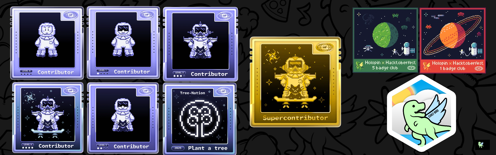
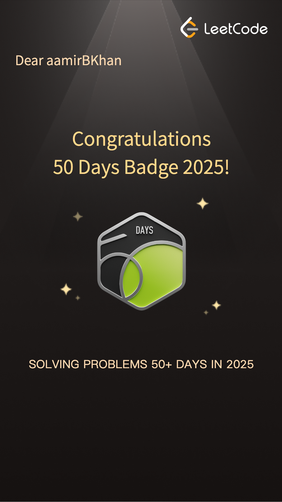
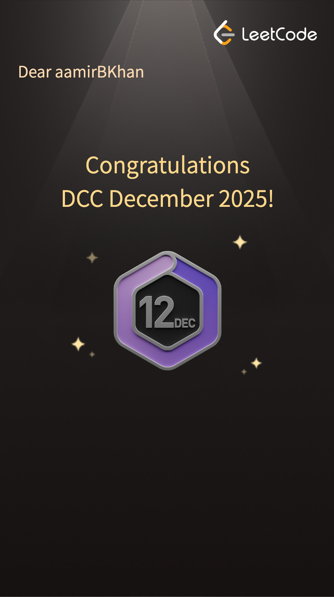

<!-- Profile README for Aamir -->

<!-- Animated typing header -->
<h1 align="center">
  
</h1>

  

<!-- About Section -->
## 👋 About Me

I'm a curious and motivated developer who loves building and learning.  
Currently studying at **MSU**, focused on real-world coding.

### 🔍 Exploring & Learning:
- 💻 **Languages & Frameworks:** Java, JavaScript, MERN Stack, Python
- 🚀 **Core Concepts:** Open Source, Data Structures & Algorithms (DSA)
- ☁️ **Cloud & Databases:** Firebase, Supabase
- 📦 **DevOps & Containers:** Docker, Kubernetes

 

> 🎯 Discover more on **[My Portfolio Website](https://portfolio-brown-ten-83.vercel.app/)**

---

## 🏅 Badges & Achievements

  
  

---

## 💻 Tech Stack

### 🚀 Languages & Frameworks

### 🛠️ Backend & Databases

### ⚙️ DevOps & Productivity Tools

---

## 📈 GitHub Activity

---
## 📈 Contribution graph

## 🌐 Connect with Me

---

