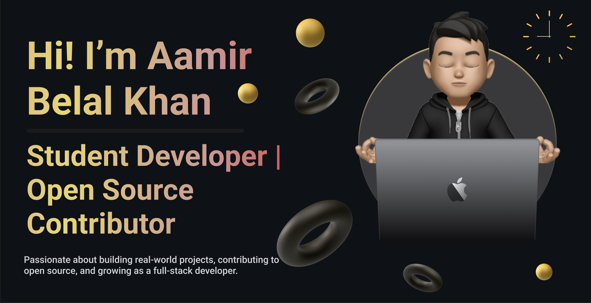

Hi, I'm Aamir, a curious and motivated developer who loves building and learning. I'm currently studying at Polaris School of Technology, a modern ed-tech college focused entirely on coding and its real-world applications.

I'm exploring Java, JavaScript, the MERN stack, and diving into open source and DSA. Always eager to grow, collaborate, and make an impact through code.

# 💻 Tech Stack:
 
 
 
 
 
 

<picture>
  <source media="(prefers-color-scheme: dark)" srcset="https://raw.githubusercontent.com/tobiasmeyhoefer/tobiasmeyhoefer/output/github-snake-dark.svg" />
  <source media="(prefers-color-scheme: light)" srcset="https://raw.githubusercontent.com/tobiasmeyhoefer/tobiasmeyhoefer/output/github-snake.svg" />
  
</picture>
